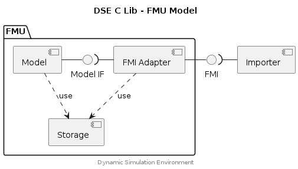

## FMU Model API


The FMU Model API (a part of the DSE C Lib) provides a simplified interface for
developing Models which adhere to the Modelica Association FMI Standard. It has
the following notable capabilities:

* Models are compatible with either FMI 2 or FMI 3 (selected via linker).
* Simple model lifecycle:
  * `fmu_model_init()`
  * `fmu_model_step()` - only function needed for a minimal FMU implementation!
  * ...
* Storage system with fast hash based index for all FMI Variable types, including binary data.
* Integration with [DSE Network Codec API](https://github.com/boschglobal/dse.standards/tree/main/dse/ncodec)
  which provides a MIMEtype selected (and configured) CAN Virtual Buses. The Network Codec has a simple
  to use programming interface:
  * `ncodec_write()` / `ncodec_flush()` - to send CAN frames
  * `ncodec_read()` - to receive CAN frames.


### Component Diagram

<div hidden>

```
@startuml fmu-model

title DSE C Lib - FMU Model

interface "FMI" as FmiIf
package "FMU" {
    interface "Model IF" as ModelIf
    component "Model" as Model

    component "FMI Adapter" as FmiFmu
    component "Storage" as Storage
}
component "Importer" as Importer

FmiIf -left- FmiFmu
FmiIf )-right- Importer

Model -right- ModelIf
ModelIf )-right- FmiFmu

Model .down.> Storage : use
FmiFmu .down.> Storage : use


center footer Dynamic Simulation Environment

@enduml
```

</div>




### Example


The following example shows a minimal model implementation which simply
increments a counter.




### Linking

When building an FMU, link the following files:

- fmu.c : generic implementation parts
- storage.c : storage mechanism
- fmi2/fmi2fmu.c : version specific parts
- model.c : model specific parts


## Typedefs

### FmuAdapterDesc

```c
typedef struct FmuAdapterDesc {
    const char * name;
    FmuLoadHandler load_func;
    FmuInitHandler init_func;
    FmuStepHandler step_func;
    FmuUnloadHandler unload_func;
    FmuSetVarHandler set_var_func;
    FmuGetVarHandler get_var_func;
}
```

### FmuInstDesc

```c
typedef struct FmuInstDesc {
    const char * name;
    const char * path;
    void * model_doc;
    FmuAdapterDesc * adapter;
    FmuStrategyDesc * strategy;
    void * inst_data;
    void * model_desc;
}
```

### FmuModelDesc

```c
typedef struct FmuModelDesc {
    FmuMemAllocFunc mem_alloc;
    FmuMemFreeFunc mem_free;
    void * instance_data;
    void * private;
    int external_binary_free;
}
```

### FmuStrategyDesc

```c
typedef struct FmuStrategyDesc {
    const char * name;
    FmuStrategyExecuteFunc exec_func;
    FmuStrategyMapVariables map_func;
    FmuStrategyToVariables marshal_to_var_func;
    FmuStrategyFromVariables marshal_from_var_func;
    FmuStrategyMapDestroy map_destroy_func;
    double step_size;
    double model_time;
    double stop_time;
    double model_time_correction;
}
```

### storage_bucket

```c
typedef struct storage_bucket {
    storage_type type;
    int index;
}
```

## Functions

### fmi2_cosim_execute

Applies an action (load, init, step etc) from an FMI2 CoSim execution strategy
to the specified FMU instance. The strategy action will call FMU methods
according to the FMI Standard.

#### Parameters

inst (FmuInstDesc*)
: Model Descriptor, references various runtime functions and data.

action (FmuStrategyAction)
: The action which should be executed by the strategy.

#### Returns

0
: Success, an equivalent status is passed to the FMU Importer.

!0
: Failure, an equivalent status is passed to the FMU Importer.


### fmu_model_create

Creates an FMU Model Descriptor object and performs any necessary
initialisation of the FMU Model.

Called by `fmi2Instantiate()`.

Called by `fmi3InstantiateCoSimulation()`.

#### Parameters

fmu_inst (void*)
: FMU provided instance data.

mem_alloc (FmuMemAllocFunc)
: Function pointer for the memory allocation function which the Model should
  use. Recommend using calloc().

mem_free (FmuMemFreeFunc)
: Function pointer for the memory free function which the Model should use.
  Typically free().

#### Returns

FmuModelDesc*
: A new FMU Model Descriptor object.


### fmu_model_destroy

Called by `fmi2FreeInstance()`.

Called by `fmi3FreeInstance()`.

#### Parameters

model_desc (FmuModelDesc*)
: Model Descriptor, references various runtime functions and data.

#### Returns

0
: Success, an equivalent status is passed to the FMU Importer.

!0
: Failure, an equivalent status is passed to the FMU Importer.


### fmu_model_finalize

Releases the resources created by `fmu_model_create()`.

Called by `fmi2FreeInstance()`.

Called by `fmi3FreeInstance()`.

#### Parameters

model_desc (FmuModelDesc*)
: Model Descriptor, references various runtime functions and data.


### fmu_model_init

Called by `fmi2ExitInitializationMode()` as the FMU exits initialisation mode.

Called by `fmi3ExitInitializationMode()` as the FMU exits initialisation mode.

#### Parameters

model_desc (FmuModelDesc*)
: Model Descriptor, references various runtime functions and data.

#### Returns

0
: Success, an equivalent status is passed to the FMU Importer.

!0
: Failure, an equivalent status is passed to the FMU Importer.


### fmu_model_step

Called by `fmi2DoStep()`.

Called by `fmi3DoStep()`.

#### Parameters

model_desc (FmuModelDesc*)
: Model Descriptor, references various runtime functions and data.

#### Returns

0
: Success, an equivalent status is passed to the FMU Importer.

!0
: Failure, an equivalent status is passed to the FMU Importer.


### fmu_model_terminate

Called by `fmi2Terminate()`.

Called by `fmi3Terminate()`.

#### Parameters

model_desc (FmuModelDesc*)
: Model Descriptor, references various runtime functions and data.

#### Returns

0
: Success, an equivalent status is passed to the FMU Importer.

!0
: Failure, an equivalent status is passed to the FMU Importer.


### storage_destroy

Destroy any allocated storage.

#### Parameters

model_desc (FmuModelDesc*)
: Model Descriptor.

#### Returns

0 (int)
: Success.

+ve (int)
: Failure, inspect errno for the failing condition.


### storage_get_bucket

Returns a reference/pointer to the requested storage bucket.

#### Parameters

model_desc (FmuModelDesc*)
: Model Descriptor.

type (storage_type)
: Indicate the storage type bucket which should be retrieved.

#### Returns

storage_bucket*
: Reference to the requested storage bucket.

NULL
: The specified storage bucket is not provisioned.


### storage_init

Initialise the storage subsystem for an FMU.

#### Parameters

model_desc (FmuModelDesc*)
: Model Descriptor.

#### Returns

0 (int)
: Success.

+ve (int)
: Failure, inspect errno for the failing condition.


### storage_ref

Get a reference (pointer to) the specified storage value. The returned
reference must be cast to the provided storage_type by the caller before
accessing the storage value.

#### Parameters

model_desc (FmuModelDesc*)
: Model Descriptor.

vr (unsigned int)
: FMU Variable Reference.

type (storage_type)
: Indicate the storage type bucket from which the storage reference should
  be retrieved.

#### Returns

void*
: Reference to a storage value (caller must cast to storage_type).

NULL
: A reference to the storage value could not be retrieved.

#### Example


```c
#include <dse/fmi/fmu.h>

static FmuModelDesc* model_desc;

int set_int_value(unsigned int vr, int value)
{
    int *ref = (int*)storage_ref(model_desc, vr, STORAGE_INT);
    if (ref == NULL) return 1;
    *ref = value;
    return 0;
}
```


