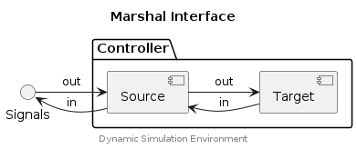

## marshal_generate_signalmap


Creates a signal map between signals (i.e. the external signal
interface) and the source (i.e. the internal interface to the target).

### Parameters

signal (MarshalMapSpec)
: A map spec for the signals to be mapped (i.e. the representation of
the signal interface).

source (MarshalMapSpec)
: A map spec for the source values to be mapped (i.e. the representation
of the target).

ex_signals (SimpleSet*)
: A set used to keep track of signals between calls (to this function)
and prevent duplicate mappings.

is_binary (bool)
: The signal map represents binary signals (i.e. `signal` and `source`
are binary signals).

### Returns

MarshalSignalMap
: A MarshalSignalMap object.


## Marshal API


The Marshal API supports two modes of operation:

1. Marshalling of intrinsic data types between _source_ and _target_ where the
   _target_ represents externally defined data structures.
2. Marshalling of signal maps between a _signal interface_ and the _source_
   data objects (of the marshalling sub-system).

When these operations are combined it becomes possible to map signals to
externally defined data structures (i.e. C style structs).


### Component Diagram

<div hidden>

```
@startuml data-marshal-interface

skinparam nodesep 55
skinparam ranksep 40

title Marshal Interface

interface "Signals" as sig
package "Controller" {
    component "Source" as sou
    component "Target" as tar
}

sig -right-> sou : out
sig <-right- sou : in
sou -right-> tar : out
sou <-right- tar : in

center footer Dynamic Simulation Environment

@enduml
```

</div>




## marshal_type_size


Return the size of a `MarshalType` (in bytes).

### Parameters

type (MarshalType*)
: A marshal type.

### Returns

size_t
: The size of the type (in bytes).


## Typedefs

### MarshalGroup

```c
typedef struct MarshalGroup {
    char* name;
    int count;
    MarshalKind kind;
    MarshalDir dir;
    MarshalType type;
    struct (anonymous struct at dse/clib/data/marshal.h:133:5) target;
    struct (anonymous struct at dse/clib/data/marshal.h:148:5) source;
    struct (anonymous struct at dse/clib/data/marshal.h:160:5) functions;
    uint64_t [4] __reserved__;
}
```

### MarshalMapSpec

```c
typedef struct MarshalMapSpec {
    const char* name;
    int count;
    bool is_binary;
    const char** signal;
    uint32_t* binary_len;
    uint32_t* binary_buffer_size;
    uint64_t [4] __reserved__;
}
```

### MarshalSignalMap

```c
typedef struct MarshalSignalMap {
    char* name;
    int count;
    bool is_binary;
    struct (anonymous struct at dse/clib/data/marshal.h:227:5) signal;
    struct (anonymous struct at dse/clib/data/marshal.h:239:5) source;
    uint64_t [4] __reserved__;
}
```

### MarshalStruct

```c
typedef struct MarshalStruct {
    char* name;
    int count;
    void* handle;
    MarshalKind kind;
    MarshalDir dir;
    struct (anonymous struct at dse/clib/data/marshal.h:179:5) target;
    struct (anonymous struct at dse/clib/data/marshal.h:186:5) source;
    uint64_t [4] __reserved__;
}
```

## Functions

### marshal_group_destroy

Release resources associated with a `MarshalGroup` table, and the table itself.

#### Parameters

mg_table (MarshalGroup*)
: A MarshalGroup list (Null-Terminated-List, indicated by member `name`).


### marshal_group_in

Marshal a `MarshalGroup` inwards (from the marshal target).

#### Parameters

mg_table (MarshalGroup*)
: A MarshalGroup list (Null-Terminated-List, indicated by member `name`).


### marshal_group_out

Marshal a `MarshalGroup` outwards (towards the marshal target).

#### Parameters

mg_table (MarshalGroup*)
: A MarshalGroup list (Null-Terminated-List, indicated by member `name`).


### marshal_signalmap_destroy

Release resources associated with a `MarshalSignalMap` table, and the
table itself.

#### Parameters

map (MarshalSignalMap*)
: A MarshalSignalMap list (Null-Terminated-List, indicated by member
`name`).


### marshal_signalmap_in

Marshal a `MarshalGroup` inwards (from the marshal target).

    Signal <-[marshal_signalmap_in()]- Source -> Target

#### Parameters

map (MarshalSignalMap*)
: A MarshalSignalMap list (Null-Terminated-List, indicated by member
`name`).


### marshal_signalmap_out

Marshal a `MarshalSignalMap` outwards (towards the marshal target).

    Signal -[marshal_signalmap_out()]-> Source -> Target

#### Parameters

map (MarshalSignalMap*)
: A MarshalSignalMap list (Null-Terminated-List, indicated by member
`name`).


