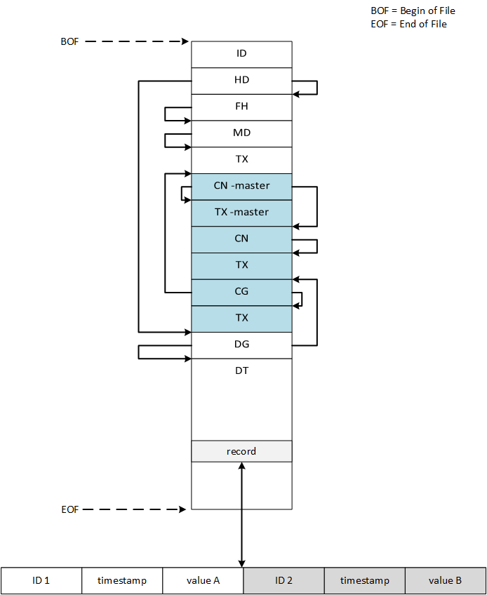

## MDF API


The MDF API (a part of the DSE C Lib) provides methods for
creating an MDF4 data stream.
Data is saved according to the [ASAM
Standards](https://www.asam.net/standards/detail/mdf/wiki/).

Because of the streaming design the exact number of samples written to an
MDF file is not known when the MDF file is initially created.
Accordingly, to indicate this condition, the follwing flags are set in the MDF
file:

* Update of cycle counters for CG-/CABLOCK required.
* Update of length for last DTBLOCK required.


### Block Order Diagram




> Note: Repeating elements are marked in blue.


### Example


The following example demonstrates how to use the MDF API for a simple
arrays based data source.




## Typedefs

### MdfChannelGroup

```c
typedef struct MdfChannelGroup {
    const char* name;
    size_t count;
    int record_count;
    const char** signal;
    double* scalar;
    int record_id;
}
```

### MdfDesc

```c
typedef struct MdfDesc {
    FILE* file;
    size_t offset;
    struct {
        MdfChannelGroup* list;
        size_t count;
    } channel;
}
```

## Functions

### mdf_create

Create and configure an `MdfDesc` object to represet an MDF stream.

#### Parameters

file (void*)
: File stream pointer.

list (MdfChannelGroup*)
: Pointer to a list of MdfChannelGroup objects which specifies the MDF
  channel and signal source.

count (size_t)
: Number of objects in the `list`.

#### Returns

MdfDesc (struct)
: MdfDesc object.


### mdf_start_blocks

Write the start blocks of an MDF4 file to the MDF file stream.

#### Parameters

mdf (MdfDesc*)
: MdfDesc object.


### mdf_write_records

Write the current channel samples to the MDF file stream.

#### Parameters

mdf (MdfDesc*)
: MdfDesc object.

timestamp (double)
: Timestamp to apply for this set of samples.


