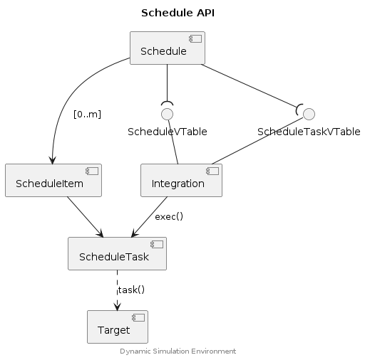

## Schedule API


The Schedule API proves a task schedule with configurable beat and an optional
delay. Interfaces of the `Schedule` object allow for customization of the
schedule behaviour, these include:

* `ScheduleVTable` - tick and marshalling call interfaces.
* `ScheduleTaskVTable` - Support custom task call interfaces, the default is a
  simple `void (*)(void)` function call.


### Component Diagram

<div hidden>

```text
@startuml schedule-api

skinparam nodesep 55
skinparam ranksep 40

title Schedule API

component "Schedule" as s
component "ScheduleItem" as sI
component "ScheduleTask" as sT
interface "ScheduleVTable" as sVT
interface "ScheduleTaskVTable" as sTVT
component "Integration" as vT
component "Target" as task

s --( sVT
s --( sTVT

sVT -- vT
sTVT -- vT

s ---> sI : [0..m]
sI --> sT

vT --> sT : "exec()"

sT ..> task : "task()"


center footer Dynamic Simulation Environment

@enduml
```

</div>




### Example





## Typedefs

### Schedule

```c
typedef struct Schedule {
    ScheduleVTable vtable;
    ScheduleItem* list;
    int count;
    double schedule_time;
    double* delay;
    double beat;
    uint32_t tick;
    bool init_tick_done;
    ScheduleTaskVTable task_vtable;
}
```

### ScheduleItem

```c
typedef struct ScheduleItem {
    ScheduleTask task;
    uint32_t schedule_beats;
    uint32_t alarm;
}
```

### ScheduleTaskVTable

```c
typedef struct ScheduleTaskVTable {
    ScheduleTaskExec exec;
    ScheduleTaskInfo info;
    ScheduleTaskFree free;
}
```

### ScheduleVTable

```c
typedef struct ScheduleVTable {
    void* data;
    ScheduleTick tick;
    ScheduleMarshal marshal_in;
    ScheduleMarshal marshal_out;
    ScheduleMarshal marshal_noop;
}
```

## Functions

### schedule_add

Add a task to the schedule.

#### Parameters

s (Schedule*)
: A schedule descriptor object.

task (ScheduleTask)
: A task object (void*). This may represent any type or object that is
  supported by the configured `ScheduleTaskVTable`.

schedule_beats (uint32_t)
: Indicates the schedule of the task in beats. Set to 0 for initialisation
  tasks.


### schedule_configure

Configure a schedule object.

#### Parameters

s (Schedule*)
: A schedule descriptor object to be configured.

vtable (ScheduleVTable)
: Reference to a ScheduleVTable object. Can be provided as a null object
  (e.g. `(ScheduleVTable){ 0 }`) in which case the default `tick` function
  is configured (`schedule_default_tick`).

task_vtable (ScheduleTaskVTable)
: Reference to a ScheduleTaskVTable object. Can be provided as a null object
  (e.g. `(ScheduleTaskVTable){ 0 }`) in which case the default `exec` function
  is configured (`schedule_default_exec`).

beat (double)
: The schedule beat. If 0 then the default `DEFAULT_BEAT` is used (1 mSec).

delay (double*)
: Pointer to a delay value which will be applied to the schedule. Set to NULL
  if no delay should be configured.


### schedule_destroy

Releases any resourced allocated to the schedule. If `ScheduleTaskVTable.free`
is configured then that function is called, the implementation of that function
should release resources allocated to each `ScheduleItem` object as required.

#### Parameters

s (Schedule*)
: A schedule descriptor object.


### schedule_tick

Tick the schedule items, and execute tasks as required.

#### Parameters

s (Schedule*)
: A schedule descriptor object.

simulation_time (double)
: The current simulation time.


